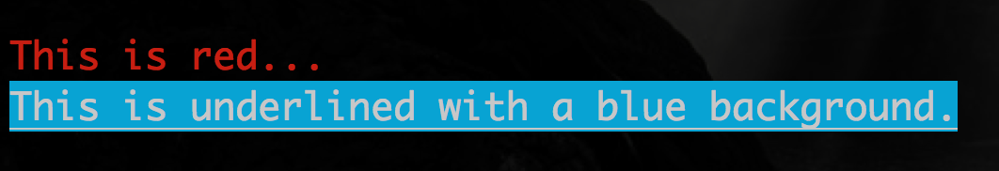

Sparkles
========

Sparkles is a library for formatting text in a terminal.

Right now only color is supported, but conceivably more complicated formatting could exist.

Use
===

```clojure
(ns foo.bar
  (require sparkles.core :as sparkles))

(def red (sparkles/color {:fg :red}))
(def underlined-blue (sparkles/color {:bg :blue
                           :styles [:underline]}))

(println (red "This is red..."))
(println (underlined-blue "This is underlined with a blue background."))
```

gives


